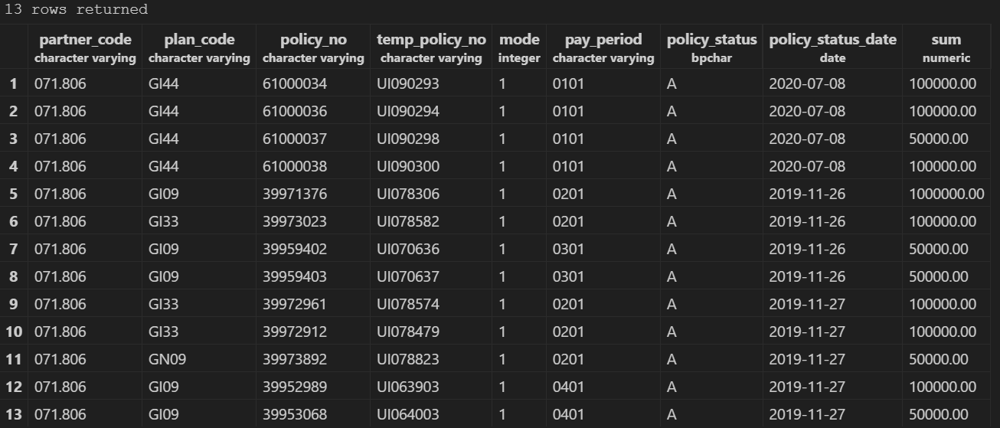
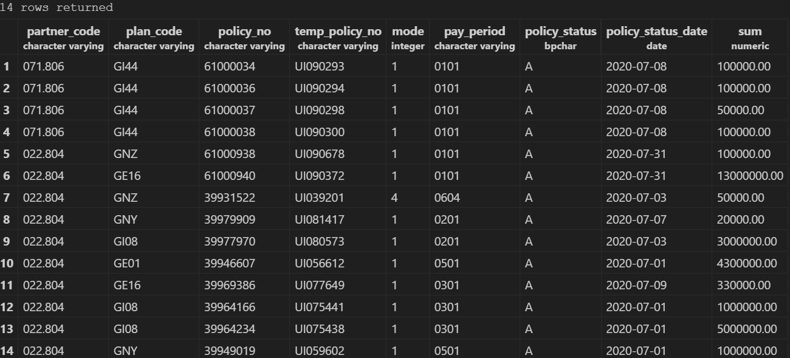
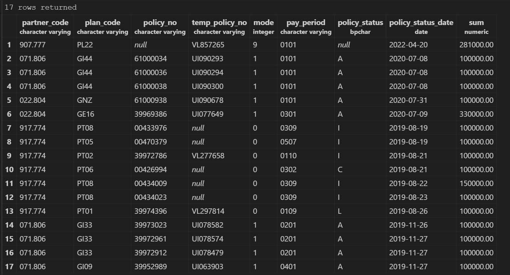
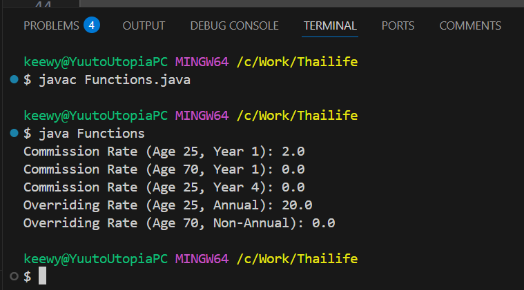
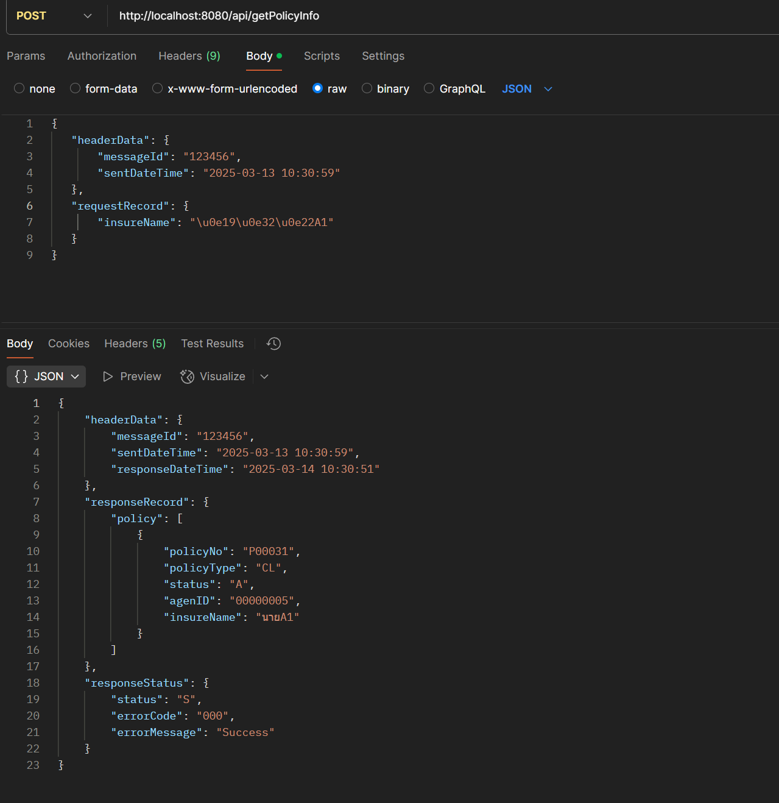

# Thailife Technical Test Submission

This repository contains solutions to the technical test for Thailife. Result pic include at the bottom.

- Already include some picture of  results, but can run it yourself to check, I already create mockup database for web-service problem
- I use most of my time to fix encoding issues to make database and java can read "นายA1" in input correctly (seems like gradle or hibernate with UTF-8 encoding issue). but still fail, needs to query with \u0e19\u0e32\u0e22A1 instead
---

## Setup Instructions

### Step 1: Install Dependencies
- PostgreSQL
- Java 21
- Gradle
- VS Code

---

### Step 2: Database Setup
1. Open PostgreSQL and create the database:
   ```sql
   CREATE DATABASE DBCorebiz;

   CREATE DATABASE "MockupDB"
    WITH OWNER = postgres
    ENCODING = 'UTF8'
    LC_COLLATE = 'th_TH.UTF-8'
    LC_CTYPE = 'th_TH.UTF-8'
    TEMPLATE = template0;

   ```
2. Import the provided SQL file:
   ```sql
   \i SQLprob\.sql
   ```
3. For the Mockup Database:
   ```sql
   \i ThailifeWebService\src\main\resources\mockdata.sql
   ```

---

### Step 3: Web Service Setup
1. Navigate to the `ThailifeWebService` folder.
2. Update the `application.properties` file with your database credentials:
   ```
   spring.datasource.url=jdbc:postgresql://localhost:5432/MockupDB?charSet=UTF8
   spring.datasource.username=your_username
   spring.datasource.password=your_password
   ```
3. Build and run the web service using Gradle:
   ```
   ./gradlew bootRun
   ```

---

### Step 4: Testing the Web Service
- Use Postman or a web browser to test the endpoints.
- Example endpoint(need to use"insureName": "\u0e19\u0e32\u0e22A1" instead of "insureName": "นายA1" due to encoding issue i can't fix rightnow. ;-;):
  ```
  POST http://localhost:8080/api/getPolicyInfo

  Header: Content-Type : application/json
  Body: raw json
  {
   "headerData": {
       "messageId": "123456",
       "sentDateTime": "2025-03-13 10:30:59"
   },
   "requestRecord": {
      "insureName": "\u0e19\u0e32\u0e22A1"
   }
   }
  ```

---

### Step 5: SQL Query Instructions
1. Open PostgreSQL.
2. Run the provided queries from `SQLprob/.sql`.
3. Query commands:
   ```sql
   SELECT *
   FROM partnerbenefit.benefit_master
   WHERE partner_code LIKE '071.%';

   SELECT *
   FROM partnerbenefit.benefit_master
   WHERE policy_status_date >= '2020-01-01'
   AND policy_status_date <= '2020-12-31';

   SELECT *
   FROM partnerbenefit.benefit_master
   WHERE sum BETWEEN 100000 AND 500000;
   ```

---
## Result
### Query 1: Partner Code = 071.xxx


### Query 2: Policies in 2020


### Query 3: Sum between 100,000 - 500,000


## Function Problem Output


## Webservice Output

